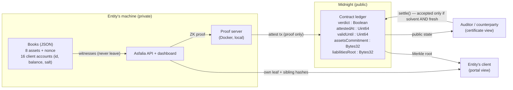

# Asfalia — Proof of Solvency that expires

> *Asfalia* comes from the Greek [**ασφάλεια** (*asfáleia*)](https://www.greek-language.gr/greekLang/modern_greek/tools/lexica/triantafyllides/search.html?lq=%CE%B1%CF%83%CF%86%CE%AC%CE%BB%CE%B5%CE%B9%CE%B1):
> safety, security, assurance. In finance, that promise becomes solvency — confidence
> that assets can cover obligations. Asfalia makes that confidence private, verifiable,
> and time-bound.

**Asfalia lets an entity (exchange, fintech, treasury) prove that its assets cover its
liabilities without revealing a single number — and the certificate it produces
*expires on-chain*.** A cryptographically perfect proof, presented after its validity
window, is rejected by the chain itself. Solvency is not a trophy; it is a state that
must be renewed.

Built on [Midnight](https://midnight.network) during **Hack Buenos Aires 2026**
(Beginner Track). Every proof-of-reserves in production today is born stale — a
snapshot that can be shown months later as if it were fresh. Asfalia's verdict carries
its own expiry, enforced by circuit, not by promise.

---

## The four moments

1. **Privacy** — the entity attests. The auditor sees `SOLVENT`, verified on-chain.
   Pressing *reveal data* shows an empty record: the balances never left the
   entity's machine. The proof traveled; the numbers, never.
2. **Integrity** — edit one hidden client balance and re-attest: the math breaks,
   `NOT SOLVENT`, and the public commitments visibly change. The proof is bound to
   the real books — lie and it shatters.
3. **Freshness** — wait out the window: the same valid certificate is now
   **rejected by the chain** (`failed assert: certificate has expired`). No oracle,
   no trusted clock — the block time comparison lives inside the circuit.
4. **Completeness** — every client of the entity can verify, in the client portal,
   that *their own* balance is included in the declared liabilities: a Merkle
   inclusion proof checked against the on-chain root. Hide an account — or lie
   about its balance — and that client's verification fails.

## Architecture

Midnight separates public state (on-chain ledger) from private state (*witnesses*,
which live on the prover's machine). [Compact](https://docs.midnight.network/compact)
compiles the contract into ZK circuits; proofs are generated locally against a proof
server and verified on-chain.



### What the circuit guarantees (`contracts/asfalia.compact`)

- **Sums inside the circuit.** `attest` receives the full asset list and all 16
  client accounts as witnesses and aggregates them in-circuit — the guarantee covers
  every item, not an aggregate the prover could fabricate. Accumulator is `Uint<68>`
  (16 × 64-bit terms fit in 68 bits): no silent overflow is possible.
- **Witness–commitment binding.** Witnesses are *not* cryptographically verified by
  themselves — the prover supplies them. That is why the circuit never trusts a raw
  value: assets are bound to a `persistentCommit` (with a 32-byte nonce) published
  on-chain. Edit one cent and the commitment changes.
- **Merkle tree of liabilities, built in-circuit.** Each client account is a leaf
  `persistentHash(id, balance, salt)` — the salt blinds the balance from tree
  siblings. The circuit computes the 16-leaf root *inside* and publishes it: the
  liability total used for the verdict and the published root come from the same
  leaves, so no account can be hidden from one without breaking the other. The
  server reuses the contract's own exported pure circuits (`leafHash`, `pairHash`)
  for inclusion proofs — hashes match by construction, not by convention.
- **Time anchoring without an oracle.** The prover declares `now`; the circuit
  requires `blockTimeGte(now) && blockTimeLt(now + attestTolerance)` — the declared
  timestamp must sit inside a window around the actual block time, so attestations
  can be neither backdated nor postdated. The tolerance is fixed in the constructor,
  rather than supplied by each caller. Block time is epoch **seconds**.
- **Authorized issuance.** The constructor stores a domain-separated hash of the
  entity's private authority secret. `attest` proves knowledge of that secret, so a
  third party cannot replace the current certificate.
- **Expiry as circuit law.** `attest` records `validUntil = now + certificateValidity`,
  where validity is also fixed in the constructor.
  The `settle` circuit — the counterparty accepting the certificate — asserts
  `verdict && blockTimeLt(validUntil)`. Past the window, the transaction fails at
  the assert. Rejection is consensus, not UI.

### What is public, what is private

| | |
|---|---|
| **Public (ledger)** | verdict (boolean) · attest timestamp · validity deadline · assets commitment · liabilities Merkle root |
| **Private (witnesses)** | every balance, every account, every aggregate — they never touch the ledger, the logs, or the network |
| **Per-client (portal)** | their own balance and a path of sibling *hashes* — never another client's balance |

## Running it

Requirements: Node 22+, Docker (Compose v2), Compact compiler 0.31.1
(`curl --proto '=https' --tlsv1.2 -LsSf https://github.com/midnightntwrk/compact/releases/latest/download/compact-installer.sh | sh && compact update`).

```bash
npm install
export ASFALIA_OWNER_SECRET="$(openssl rand -hex 32)" # keep in a secret manager
npm run setup            # local devnet + Compact compile + deploy
npm run build            # strict TypeScript checks + production UI bundle
npm test                 # 19-case circuit suite (simulator, no proof server)
npm run attest           # one-shot: real ZK proof -> verdict on-chain
npm run dashboard        # build UI + serve API on http://localhost:3300
```

The entity console always binds to loopback. To expose the read-only auditor and
client portal, use a separate port and account-scoped client tokens; never proxy
the private port:

```bash
ASFALIA_PUBLIC_PORT=8080 \
ASFALIA_CLIENT_TOKENS='{"replace-with-a-long-random-token":"AX-2026-0001"}' \
npm run dashboard
```

Deploying to the public **preview** testnet is one flag:
`npm run setup -- --network preview`. It requires the same 64-hex
`ASFALIA_OWNER_SECRET`, an existing funded `MIDNIGHT_WALLET_MNEMONIC` or
`MIDNIGHT_WALLET_SEED`, and a 16+ character `PRIVATE_STATE_PASSWORD`, all supplied
from a secret manager. Asfalia never generates, prints or stores public-network
wallet credentials. `ASFALIA_TOL` and `ASFALIA_VALIDITY` become immutable contract
policy at deployment. Legacy state files can be scrubbed only after backup with
`npm run network -- scrub-wallets`.

The dashboard opens with a **role picker** — the separation is the product
(see [docs/deployment.md](docs/deployment.md) for who runs what, where):

- **Entity** (local console) — the private books (8 assets, 16 client accounts),
  editable, live coverage, *Generate attestation*, and local daemon telemetry for
  the heartbeat. No login: possession is authentication.
- **Auditor / counterparty** (public, read-only) — the stamped certificate with
  its on-chain validity countdown and commitments. The local console also offers
  operational history/scanning, but those views are not exposed as chain-derived
  public truth. The local demo can submit
  `settle()` with the entity wallet; a remote counterparty must submit with its own
  wallet rather than spend through the entity API.
- **Client** — enter an account, expected balance and its scoped access code. The
  browser derives the id from the account, rebuilds the leaf with the returned salt,
  folds the sibling path locally, and compares the result with the on-chain root.
  No account directory is exposed.

## Tests

`npm test` runs a 19-case suite against the circuit simulator, covering the verdict
(including the exact-equality edge and the one-cent-over case), zero balance leakage
into public state, circuit-root/server-root equality, real inclusion proofs, the
hidden-account and lied-balance failure paths, commitment determinism and
sensitivity, timestamp anchoring, and `settle` accepting fresh certificates while
rejecting insolvent and expired ones. A lied number breaks exactly the test that
should break.

## Honest limits

The proof guarantees that the *committed* numbers satisfy solvency — no system can
cryptographically guarantee the numbers are real without attested sources. On-chain
assets can be proven with wallet signatures; off-chain assets still need an auditor
attesting sources. Liability completeness is covered by the Merkle layer — a client
whose account is hidden or understated will catch it — but only for clients who
check. Asfalia replaces the recalculation and the exposure, not the auditor: it turns
a quarterly snapshot into continuous, private verification.

## License

[Apache 2.0](LICENSE)
