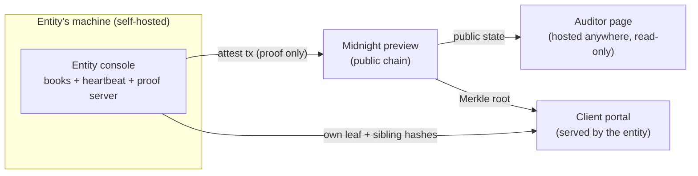

# Asfalia — deployment model: who runs what, where

Three roles, three deployments. The separation is the product: each party runs
only what it needs, and no party can see more than its role allows.



## 1 · Entity console — the certifier (runs LOCAL)

The books never leave the entity's machine, so this is the only component that
*must* be self-hosted. **No login: possession is authentication** — whoever
controls the machine and the books files controls the signature, exactly like a
signing server. In production you'd wrap OS-level access control around it
(disk encryption, user permissions), not a web login.

Simplest path today (one repo, six commands):

```bash
git clone https://github.com/Jc-asastu/asfalia && cd asfalia
npm install
npm run compile                 # Compact -> circuits + keys (needs compact 0.31.1)
docker compose up -d proof-server
npm run network preview
export ASFALIA_OWNER_SECRET="$(openssl rand -hex 32)"  # keep in a secret manager
export ASFALIA_TOL=300                              # fixed at deployment
export ASFALIA_VALIDITY=2592000                     # 30 days, fixed at deployment
npm run setup                   # generates wallet, prints faucet URL, deploys
ASFALIA_HEARTBEAT_SEC=86400 npm run dashboard
```

That last line is the daily heartbeat with a 30-day validity window — the
GENIUS Act cadence. The same `ASFALIA_OWNER_SECRET` must be available to the
daemon for every future attestation; losing it requires a new deployment. It is
never printed or stored in `.midnight-state.json`. Replace the books in `data/demo-entity.json` and
`data/demo-users.json` with real exports (same shape).

**Why a daemon and not a web page:** a page depends on someone keeping a tab
open. The console is a **24/7 system service**: `deploy/asfalia.service` runs it
under systemd with `Restart=always` (crash → relaunch in 15 s) and
`WantedBy=multi-user.target` (power cut → it comes back with the machine). The
heartbeat never depends on a human remembering anything — and a *gap* in the
history can then only mean a deliberate unplug. Install with:

```bash
sudo --preserve-env=ASFALIA_OWNER_SECRET bash scripts/install-daemon.sh
```

The installer copies that authority secret to `/etc/asfalia/asfalia.env` with
owner-only permissions so systemd can attest after a reboot. If the file already
exists it is preserved; the installer never rotates the contract authority.

The local console UI lives at `http://localhost:3300/console` — reachable only
from the entity's own machine, never linked from the public portal. The public
portal carries no balance endpoint at all: the books have no web door.

Product north star: `npx asfalia init` — one command that scaffolds the books,
installs the toolchain and starts the heartbeat as a service. The pieces already
exist; the wrapper is packaging work.

## 2 · Auditor page — the verifier (hosted anywhere)

Reads **only public chain state** through the indexer: verdict, timestamps,
validity, commitments, Merkle root, transaction history. No login — everything
it shows is already public. It can be hosted as a plain web page by anyone
(the entity, an auditor firm, Midnight community): it holds no secrets and
needs no trust, because every number it displays can be re-derived from the
chain. Rebuttal to "why trust your page?": don't — click through to
[Night Scan](https://explorer.preview.midnight.network), the network's own
explorer, and compare.

In the demo build, pick the **Auditor / counterparty** role on the landing.

## 3 · Client portal — the depositor (served by the entity)

The inclusion proof contains the client's own balance, so in production this
endpoint lives behind the entity's existing client authentication (it is the
same trust boundary as their home banking). Two deployment shapes:

- **Portal mode** (today's demo): the entity's console serves
  `/api/inclusion` per account; the client sees their balance, their leaf and
  the sibling-hash path, and the verification against the on-chain root.
- **File mode** (zero-server): the entity hands each client a small JSON proof
  file (leaf + path). The client verifies it against the on-chain root with
  any independent tool — even a one-file script. Nothing to host, nothing to
  log into; the proof is self-contained.

## Trust summary

| Component | Runs where | Login | Sees balances |
|---|---|---|---|
| Entity console | entity's machine | none — possession | all (its own) |
| Auditor page | anywhere | none — public data | none |
| Client portal | entity's infra | entity's own auth | only the client's own |
| Chain / explorer | Midnight | — | none — verdicts, roots, timestamps |
